[View this project's website.](https://joao-s-martins.github.io/leprechaun-trap/ "Leprechaun Trap website")

# Leprechaun Trap
This is the result of a kindergarten family project that was assigned to my oldest son, due in March of 2017. The requirements were to build a trap with bait. Functionality was not required and no specifics were given about the leprechaun dimensions or habits other than their love of gold, rainbows, and other seasonal items.

## The Plan
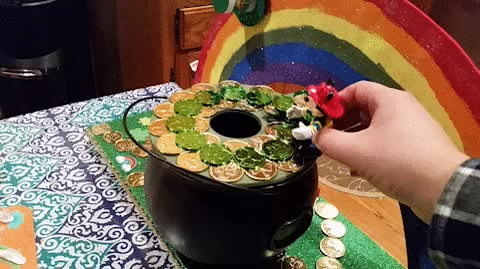

My son wanted a trap where a leprechaun would be baited by a rainbow and gold coins to travel over a open-top cage. Then my son planned to pull a rope and trap the leprechaun within the cage. I suggested that we make the cage automatically close and add lights to enhance the rainbow and coins. He loved my suggestions and we had our goals set.

## The Design
My wife pulled a plastic cauldron from our Halloween decorations for us to re-purpose as a pot of gold. I planned to give it a false lid covered in coins, with a hole sized for a leprechaun. No leprechaun dimensions were given for this project, so the final hole size was about 2.25 inches in diameter.

She also found some [stick-on foam sheets](http://www.michaels.com/creatology-foam-glitter-sheet/10148582.html#q=green+foam+sheets&start=2 "Creatology foam glitter sheets at michaels.com") that were green and sparkly. They were 12 inches by 9 inches. The project dimensions were based off of these sheets and the cauldron. I sat with my son, the sheets, the cauldron, and a measuring tape, and we decided that the full trap should be as wide as two sheets connected at the short ends (24 by 9 inches) and that the rainbow should go from end to end, behind the centered cauldron, with the bottom of it rising just a couple inches taller than the cauldron.

## Prototyping
I used [circuits.io](https://circuits.io/circuits/4252213-leprechaun-trap "This project prototyped at circuits.io") to plan the electronics. I referenced tutorials from [adafruit.com](https://learn.adafruit.com/category/learn-arduino "Arduino tutorials by Adafruit") that explain how to program an Arduino to [blink an LED](https://learn.adafruit.com/adafruit-arduino-lesson-1-blink "LED blinking tutorial by Adafruit"), detect [button input](https://learn.adafruit.com/adafruit-arduino-lesson-6-digital-inputs "Button input tutorial by Adafruit"), and [manipulate a servo](https://learn.adafruit.com/adafruit-Arduino-lesson-14-servo-motors "Servo motors tutorial by Adafruit"). I further read about blinking an LED [without using the `delay()`](https://learn.adafruit.com/multi-tasking-the-arduino-part-1/overview "Arduino multi-tasking tutorial by Adafruit") function and making [use of `interrupts`](https://www.arduino.cc/en/Reference/attachInterrupt "Interrupts reference from Arduino AG").

### The Trap Mechanism
The idea here was straight-forward; a leprechaun falls in the hole and hits a button, then a servo moves to cover the hole. In the code, you'll notice that `tripped` is a boolean variable that is checked regularly during `loop()`. It is used for state, initialized as `false`, and set `true` in `caught()`. The `caught()` function is referenced by the line `attachInterrupt(digitalPinToInterrupt(triggerPin), caught, CHANGE);`. This line is the keystone of this script; it sets the trap trigger to throw interrupt events and `caught()` as the event handler. Also take note that the `triggerPin` is `2`, as the Arduino is limited in which pins are capable of throwing an interrupt event.

The `loop()` function was designed to cycle very often. With each cycle it checks the state of `tripped`. If it's been set `true`, then the servo angle is written to cover the trap hole. Frequently writing to servo within the loop in this manor keeps me from having to call the servo `refresh()` function.

### The Lighting
The lighting was intended to create a sparkle effect, like the reflection of light gleaming off of a pool of water or coins. As such, I wanted to make sure the LEDs would be lit only for short moments in time. To obscure the pattern and create a seemingly random sparkle effect, I programed three different pins to blink at different intervals, then wired different banks of LEDs in parallel to each pin. These appear in the code as `blink1`, `blink2`, and `blink3`, each one an instance of the `Flasher` object. This object is designed to have its `update()` method called frequently, within which it decides whether to change the LED state and does so. Once the trap has been triggered, the LEDs are all turned on and remain that way as a sign that there is a leprechaun inside.

## The Build
### Electronics
Here is an idea of how the final electronics played out.

#### Breadboard
<iframe frameborder='0' height='448' marginheight='0' marginwidth='0' scrolling='no' src='https://circuits.io/circuits/4252213-leprechaun-trap/embed#breadboard' width='650'></iframe>

#### Schematic
<iframe frameborder='0' height='448' marginheight='0' marginwidth='0' scrolling='no' src='https://circuits.io/circuits/4252213-leprechaun-trap/embed#schematic' width='650'></iframe>

### Woodworks
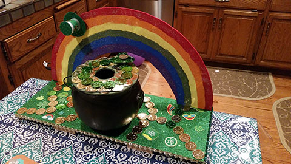

The base was made of scrap hardboard to the dimensions of the two foam sheets, 24 by 9 inches. Some scrap pieces of red oak were added underneath as feet, to allow space for wiring underneath. Some more scrap hardboard was used to create the rainbow. Two smaller pieces where glued on their long ends and braced to create a larger panel. My son helped draw the curves of the rainbow and I cut it. Some strips of red oak were added to the base of the rainbow to be screwed to the base later. The rainbow was painted and glittered by my son. I added holes to the base piece for the power switch and reset button. Another hole was added to the middle to run wires into the cauldron. The foam sheets, switch, button, cauldron, stickers, and gold coins were then added. Then my son decorated the base and I followed that by drilling 1/8 inch holes in between his decorations to install the LEDs.

I created the lid to the cauldron out of hardboard. The hole in the center was cut using a 2.25 inch hole saw and the cut-out was re-purposed as the trap hole cover. A rectangular hole was cut into the lid to mount the servo and a scrap piece of plywood was attached underneath to eventually hold the trigger button, which was a limit switch with a long lever actuator that spans most of the width of the hole. [Magnets](http://www.homedepot.com/p/MASTER-MAGNETICS-1-2-in-Neodymium-Rare-Earth-Magnet-Discs-6-per-Pack-07046HD/202526367 "Half-inch neodymium magnets from Home Depot ") were used to attach the lid to the cauldron, allowing easy access to the inner wiring and for removing any trapped leprechauns. I hot-glued three magnets under the lip of the cauldron. I then place the lid on top and let the magnetic force of the cauldron magnets guide my placement of the lid magnets. I marked their locations and used a forstner bit to partially drill sockets for the half-inch round magnets on the lid, then hot-glued them into place.

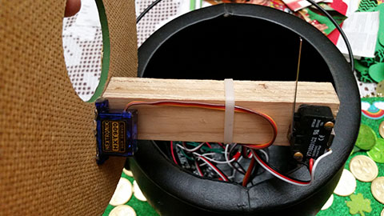
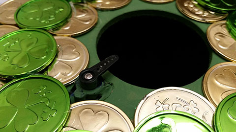
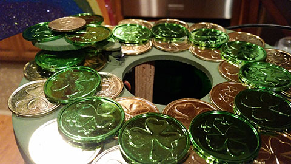

### Wiring
Most wiring was mostly done with 22 AWG solid wire. I cut a few servo extension cables to be used with the servo and trigger switch, allowing a quick disconnect of the whole lid assembly. I put a small [2-position dual-row barrier strip](https://www.radioshack.com/products/radioshack-2-position-dual-row-barrier-strips "2-position dual-row barrier strip sold by Radio Shack") inside the cauldron to help distribute 5V and ground from the Arduino. I glued an [8-position dual-row barrier strip](https://www.radioshack.com/products/radioshack-8-position-dual-row-barrier-strips "8-position dual-row barrier strip sold by Radio Shack") underneath the base to help distribute the ground, reset, and LED signals. I had really wanted to use this [lit safety switch](https://www.radioshack.com/collections/switches/products/safety-switch "Safety switch sold by Radio Shack") that I had on-hand to power the trap, so I spliced it into a USB cable and used this cable with a 2200mAh USB battery pack to power the Arduino.

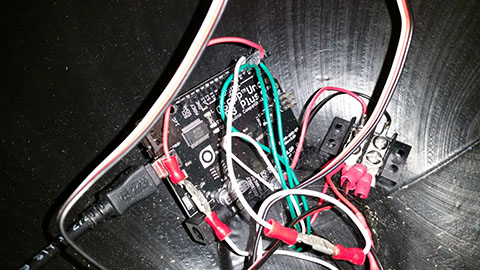
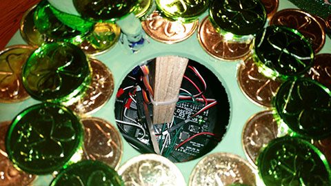
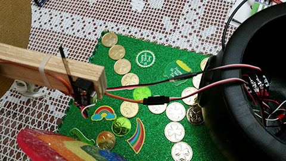
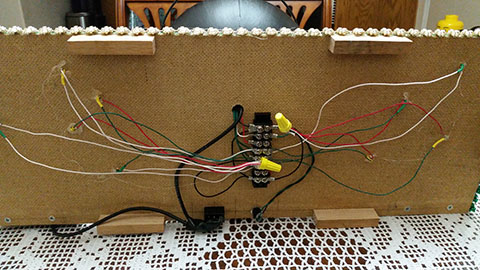
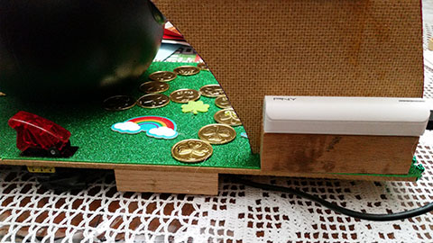

Individual [LEDs](http://frys.com/product/452769?site=sr:SEARCH:MAIN_RSLT_PG "Green LEDs sold by Fry's Electronics") had their 200Ohm resistors soldered to them along with some lengths of wire. The LEDs were installed in the small holes in the base of the trap and wires cut to reach the barrier strip. Some of my resistors turned out to be too fragile, even though I added heat shrink tubing to help reinforce them. Once everything was in place, including the Arduino Uno within the cauldron, I nervously tested the whole trap. **It all worked!** I immediately started applying hot-glue everywhere: LEDs, barrier strips, Arduino pins, and some soldered connections just for good measure. Then I tested several more times, smiling successfully :)

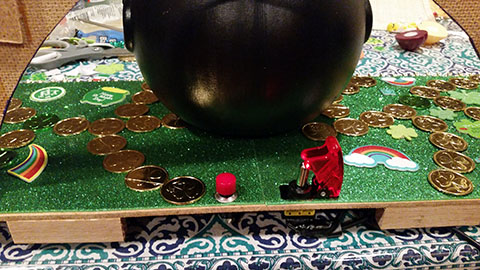

## The Result
<video width="480" height="270" controls>
  <source src="assets/vid/trap_demo_480x270_web.mp4" type="video/mp4">
Your browser does not support the video tag.
</video>
The trap was a hit that earned a perfect grade. The final result was a real attention getter; older students who toured the traps were compelled to our trap. The blinking lights highlighted the many reflective bits that my son included. The rainbow made a fantastic background. Watching my son drop small toys into the hole and reset the trap to drop more toys was hugely rewarding ;)

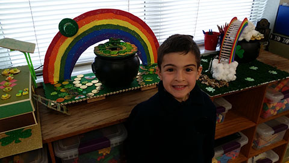

## Lessons Learned
- Only certain Arduino pins can throw interrupts.
- After handling an interrupt, control is returned to the previously interrupted portion of `loop()`; `loop()` is not restarted.
- Running a `while true` loop within an interrupt handler works for some cases, but not all, as I discovered when trying to change my servo angle within the interrupt handler. I recommend using interrupts to set state and have that state checked often within your main `loop()`.
- The power and ground cables inside of a USB cable are very, very thin.
- Test individual and assembled components frequently.
- Test soldered joints with a multimeter immediately after cooling.
- Don't get too fancy with special connectors and disconnects unless you have extra time on your hands and like being frustrated, because they add extra points of failure that can lead to diagnostic headaches.
